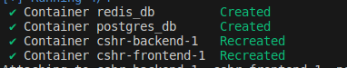

# CSHR (Codescalers HR Management System)

A comprehensive management system that provides a range of services, including the ability to submit vacation requests. This system seamlessly integrates with a global calendar, allowing users across all offices to view approved vacations collectively. Additionally, the calendar showcases Birthdates, Events, Meetings, and Holidays, offering a centralized and accessible overview for all users within the organization.

## Core Objectives

1. **Global Overview:**
   - Display a centralized calendar featuring approved vacations, holidays, events, meetings, and birthdays.
   - Search for users, view their public information, and identify their office affiliation.
   - Search for specific skillsets and identify users with those skills.

2. **Local Management:**
   - Appoint an admin for each location.
   - Restrict admin rights to the respective location without sharing across different locations.

## Access Levels

- **User:** Any individual affiliated with the organization.
- **Supervisor:** Each user has a designated supervisor.
- **Admin:** Location-specific administrators with defined responsibilities.

## Key Features

- **Global Calendar:** Track approved vacations and key events.
- **Vacation Requests:** Users can apply for vacations.
- **Approval/Denial Process:** Admins can manage and approve/deny vacation requests.
- **Document Requests:** Users can request documents from HR.
- **Evaluation Reminders:** Receive reminders for various evaluations.
- **Reporting:** Automatically generate comprehensive reports on-demand.

## Development Tools

Various tools are available for development:

- **Terraform Script:** Deploy two machines in the Threefold grid for frontend/backend. Refer to the script in [./terraform](./terraform/main.tf).
- **Testing Site Deployment:** Execute `make deploy` to deploy and `make destroy` to destroy the testing site.

## Development Mode Commands

When in development mode, use the following Makefile commands:

- `make migrate`: Apply migration and migrate.
- `make user`: Create a superuser.
- `make runserver`: Run the server.
- `make lint`: Perform linting on both server and client.
- `make install`: Install dependencies in both client and server.
- `make data`: Create dummy data for testing e.g., users/offices.

## Implementation Details

- **Client:** Developed using Svelte. Note that the UI will transition to Vue3 in the future.
- **Server:** Implemented using Django.
- **Notification Service:** Requires a running Redis server for notification functionality.

## Project Configuration

After executing

```sh
make install && make migrate
```

<<<<<<< Updated upstream
Please refer to [.env.template](./config/.env.template) for all required values. Ensure all values are populated in the `.env` file within the [config](./config/) directory.
=======
Please refer to [.env.template](./config/.env.template) for all required values. Ensure all values are populated in the `.env` file within the [config](./config/) directory.

## Runing the project using Docker and Docker Compose

To run the full project with all instances, follow these steps:

1. Set Environment Variables

Create a `.env` file beside the [config](./config/) directory and set the necessary environment variables. Refer to the previous section for sample environment variable configurations.

2. Execute Docker Compose

Run the following command to start the Docker containers:

```sh
docker compose --env-file=./config/.env up --build -d 
```

After executing the command, you should see a confirmation similar to the following:

3. Verify Successful Deployment

This indicates that the Docker containers are being created and the services are starting up.

- 
>>>>>>> Stashed changes
